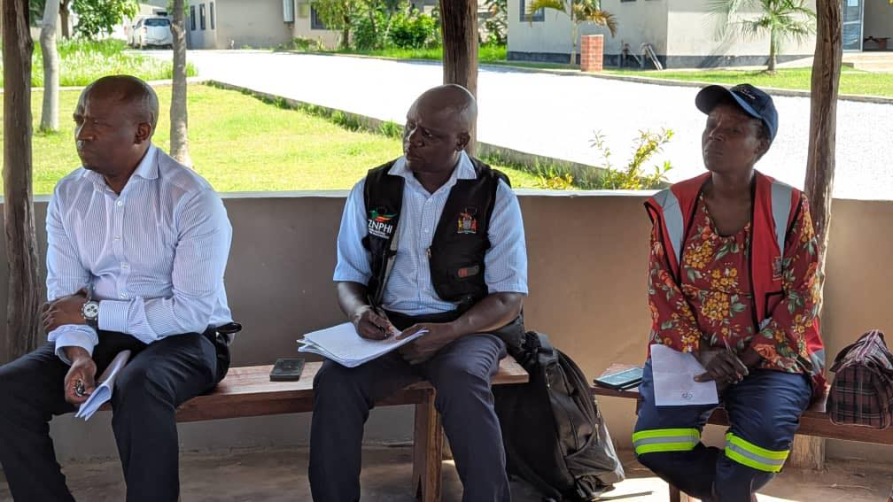
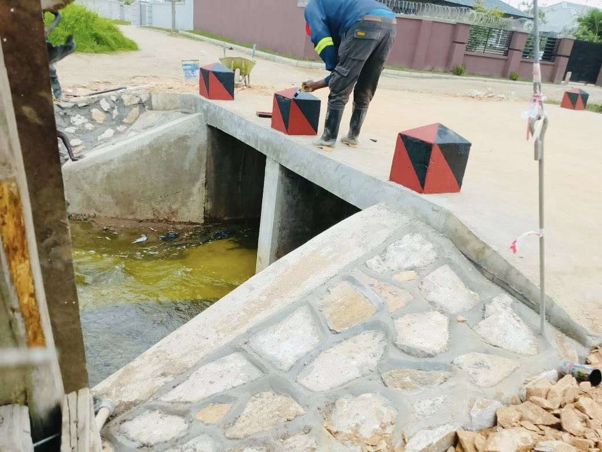
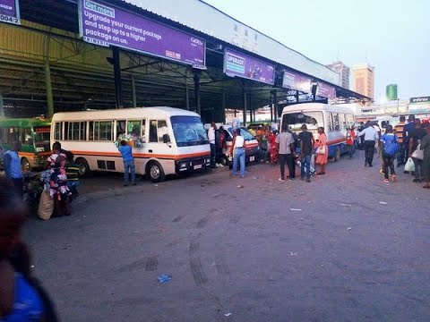
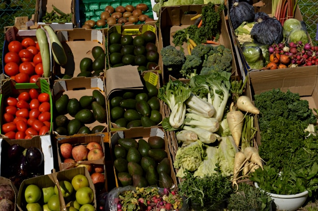
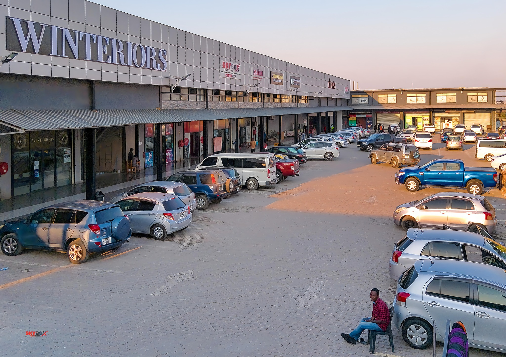
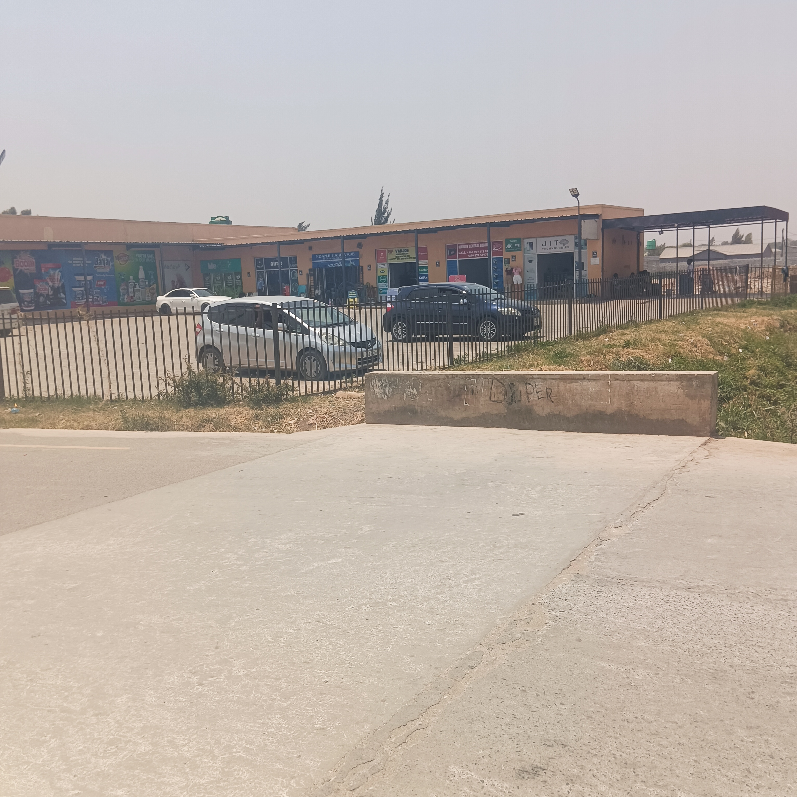

# Chongwe Council engages Kwamwena Residents on public health

Date: Monday 29th December 2025

Chongwe Municipal Council top management, led by the Town Clerk, this afternoon held an interactive meeting with homeowners in Kwamwena to discuss public health issues affecting the area. The meeting was convened at the request of the Kwamwena Home Owners Association.

In his address, the Town Clerk announced plans to drill boreholes that will service ablution blocks in the area, describing the move as a practical response to sanitation and water challenges. He emphasized that improving public health remains a top priority for the Local Authority.

Chongwe Mayor Mr Christopher Habeenzu urged homeowners to work hand in hand with the council and to remain patriotic in protecting public infrastructure and supporting development initiatives.
Home Owners Association Chairperson Mr Mutale Mwango commended the council for its responsiveness, noting that the engagement reflected commitment to driving development through collaboration with various partners.

The meeting was attended by District Commissioner Dr Evans Lupiya, Madido Area Councillor Ms Janet Chisenga, Madido Ward Development Committee Chairperson Mr James Kamui and community members, who actively participated in the discussions.

The meeting was held at the Baptist Community Church in Meanwood Kwamwena Phase 4.

*Did you see an error? Anything missing? or do you have a story to contribute? Please get in touch with us using the contact details below*

# Box Crossing Point in Kwamwena Phase 3 Completed

Date: Friday 02nd January 2026

As we begin the new year we are happy to announce the Box crossing point in Meanwood Kwamwena Phase 3 has been completed and is now open to the public.

During the works, the Local Authority in the company of His Worship The Mayor, Mr. Christopher Habeenzu, District Commissioner Dr. Evans Lupiya, Madido Ward Councillor Ms. Janet Chisenga alongside senior management and community members monitored the progress of the works.

The delegation had expressed satisfaction with the pace and quality of the works and noted the project's expected positive impact on the local community.

The crossing point is expected to help with the smooth flow of water and traffic preventing any possible flooding incidents. The crossing point is located in the central area of Meanwood Kwamwena Phase 3 near the popular bus drop off point called "Green Shop".

*Did you see an error? Anything missing? or do you have a story to contribute? Please get in touch with us using the contact details below*

# How to get to Kwamwena Valley using public transport

Date: Tuesday 30th December 2025

Ever wondered how you can get to Meanwood Kwamwena Valley using public transport?
Well, if you want to reach the nice neighbourhood of Meanwood Kwamwena Valley using public transport, here is the step-by-step procedure.

We will assume that you are in town, that is, the Lusaka city CBD. Buses for the Meanwood Kwamwena Valley route are found at Kulima Tower Bus Station.

Proceed to Kulima Tower and search for rank touts shouting, "Mutumbi! Kaunda Square!" These touts will be right next to the buses. Usually, you can find them in the rank bays near the Southwest exit of the Kulima Tower Bus Station.

As of 30th December 2025, the bus fare to Meanwood Kwamwena Valley is K20. Once you board the bus, make it known to the conductor that you are new to the place and will need help finding your drop-off point once you reach Meanwood Kwamwena Valley. The conductors are usually friendly and will gladly assist you. Just remind them occasionally along the journey.

Once the bus fills up and leaves the Kulima Tower Bus Station, it will proceed to use the Independence Avenue route, then connect to Great East Road via Addis Ababa Road. The bus will continue on Great East Road, occasionally dropping off passengers and picking up new passengers along the way. The stops along Great East Road are Manda Hill, then Arcades, then UNZA or East Park Mall, and then Marshlands. The bus will then exit Great East Road using Munali Roundabout. It will use the North exit (turn left) onto Munali Road.

The bus will proceed along Munali Road until it reaches Munali Mall. Along the way, there are pick-up and drop-off points for the Chudleigh neighbourhood. At Munali Mall, the bus will turn right and proceed to Kaunda Square Stage 1.

Inside Kaunda Square Stage 1, the bus will pick up and drop off passengers. It will make a stop at the Kaunda Square Market where a majority of Kaunda Square residents will drop off. The bus may rest for a bit of time and load up more passengers who are going to Meanwood Kwamwena Valley.

After loading up, the bus will rejoin Munali Road heading down to Meanwood Kwamwena Valley. Along the way, take note of the following places. When the bus rejoins Munali Road, the first landmark you will see is Mosi oa Tunya Mall. A few metres later, you will see Justo Mwale University, then the ZNS Headquarters Chamba Valley. 

After ZNS, you will see some sewer ponds on both sides of the road. At the end of Munali Road is where Meanwood Kwamwena Valley begins. The landmark to take note of is Engen Service Station. You will see a Hungry Lion restaurant. Once you reach this point, take a moment to appreciate the neighbourhood. "Welcome to Meanwood Kwamwena Valley!"

The first bus drop-off point is called "Mutumbi Station." This place is at the other end of the road junction opposite Engen Service Station. The bus will proceed north along the road, and the next drop-off point is "Mutumbi Cemetery," which is next to the right-turn turn-off point that leads to Mutumbi Cemetery. The bus will then continue north for about 150 metres and stop at the next drop-off point, which is called "Seybor." After "Seybor," the next drop-off point is "Police turn-off," which is about 100 metres from the previous drop. The bus will then continue north for the next 300 metres, then turn left and stop at a drop-off point called "Dangote." The bus then makes an immediate right turn and continues northbound. About 250m from the turn-off point is the next drop-off point called "Car Wash." 

Afterwards, the bus continues north for about 300 metres, then turns left to reach the next drop-off point called "Kingdom Hall Jehovah's Witnesses" or "Watchtower." This is followed by an immediate right turn. The next drop-off point is called "Green Shop," which is 300 metres from the turn-off point in the northbound direction. When the bus leaves the "Green Shop" drop-off, it will proceed for about 300 metres to reach the last drop-off point, also known as "The last bus stop" or "Market." This is the market area designated by the Chongwe Municipal Council. You will see a lot of vendors, market stalls, and shops.

This completes the step-by-step guide on how to use public transport to reach Meanwood Kwamwena Valley. I hope you enjoyed it and found the information useful. 

*Don't hesitate to reach out if you have any questions, comments, or suggestions. The Meanwood Kwamwena Community Hub  values feedback in any shape or form.*

# Let's Map Kwamwena Initiative

Date: Friday 26th December 2025

The Let’s Map Kwamwena Initiative is a community-driven effort to create a clear, accurate digital map of the Kwamwena Valley neighbourhood.

The project is in its infancy stage and community members are welcome to join in the initiative. The first phase of the project aims to educate the community on the importance of mapping. Hopefully, this can spur an interest in finding out how to accurately add a location to a map. Mapping not only helps you, it helps others who are unfamiliar with the area and are in need of accurate navigation to guide them. We don't want people to get lost trying to find their way around an area. 

As the sensitization and promotion of the project grows, we hope to educate the community on how to accurately add a place to a digital map like Google Maps. More over, teach others how to verify if the place is marked correctly.

I hope this little snippet into the "Let's Map Kwamwena Initiative" has inspired you to want to get involved. If so, don't hesitate to reach out. If you have any questions, comments, or suggestions in relation to the project feel free to tell us.

*Did you see an error? Anything missing? or do you have a story to contribute? Please get in touch with us using the contact details below*

# Where to shop in Kwamwena Valley

Date: Monday 22nd December 2025

Need to get some groceries for your home? Here is a comprehensive guide of all the places to shop within Kwamwena Valley.

## Chamba Valley Shopping Mall

Chamba Valley Shopping Mall popularly known as "Cheers Mall" is located along Mutumbi Road in Meanwood Kwamwena Valley Phase 1, Lusaka, Zambia serving as one of the main shopping areas for our community.

Operating Hours:
Open 7 days a week, with businesses operating from as early as 5:00 AM to as late as 9:00 PM.

Facilities:
✅ Parking space available (both inside and outside the mall)
✅ Fee-paying toilets (K5)
✅ Street lighting
✅ Zanaco Bank ATM

Businesses that trade at Chamba Valley Shopping Mall are as follows:
- Airtel Zambia Shop
- Beyond Trends Home Decor - Everything Home
- BubbleBath Car Wash
- Cheers Hypermarket
- Chicken Shawarma Stand
- Cloudsmart Enterprise
- Colorful Culture
- Dynamic Steam Laundry
- Elkorashy Limited
- Fragrance Corner
- Geo Link Investments & Hardware Ltd
- Hawa's kitchen
- Legana Meats
- Mosaic Construction Limited
- Namfeeds Chamba Valley
- NutriFitness Gym and Massage Spa
- Pearl'z Boutique
- Skybox_mediahouse Skybox Enterprises
- SunOak Pharmacy 
- Sunray Power Company
- Uwami Cedar Salon & Barbershop
- VPL Zambia 
- Winteriors Zambia

For enquiries contact Mall Management on +260 770 088 088

## Mama's Supermarket Shopping Complex

Mama's Supermarket Shopping Complex is located in Phase 1 of Meanwood Kwamwena, near the road that borders Phase 1 and Phase 2.

**Operating Hours**:
Open 7 days a week, with businesses operating from as early as 5:00 AM (0500h) to as late as 10:00 PM (2200h).

**Facilities**:
✅ Parking space available inside
✅ Non-paying toilets
✅ CCTV Security
✅ Lighting
✅ Car wash

Businesses that trade at Mama's Supermarket Shopping Complex are as follows:

- Mama's Supermarket
- JIT Technologies
- Marjory General Dealing
- Vanjoe General Dealers
- Ndanji Hardware and General Dealers
- Lifedew Pharmacy
- Nimo Empire Barbershop and Salon

## Rizban Mall

Rizban Mall is located in Phase 3 of Meanwood Kwamwena. The location is in the western side of Phase 3 along the tarmac that links Phase 3 to Phase 4.

**Operating Hours**:
Open 7 days a week, with businesses operating from as early as 5:00AM (0500h) till as late as 11:00PM (2300h).

**Facilities**:
✅ Parking space available inside
✅ Fee-paying toilets (K5)
✅ CCTV Security
✅ Lighting

Businesses that trade at Rizban Mall are as follows:

- Mama's Supermarket
- JIT Technologies
- Marjory General Dealing
- Vanjoe General Dealers
- Ndanji Hardware and General Dealers
- Lifedew Pharmacy
- Nimo Empire Barbershop and Salon

## Kwamwena Market

The Kwamwena Market is located in Phase 3 and Phase 4 of Meanwood Kwamwena. It is specifically on the borders of the road that divides Phase 3 and Phase 4.

It hosts general dealers, informal traders like market gardening vendors, and a wide plethora of traders all providing a variety of services. These include tailors, clothing shops, hardware shops, grocery stores, carpenters, butcheries and so on. The market is still growing as more and more traders are setting up shop.

It will also house the Trader's Market which is a project being spearheaded by the Local Authority, Chongwe Municipal Council as part of the Constituency Development Fund projects for Meanwood Kwamwena area.

---

This is not an exhaustive list as there are many other traders littered all over the Kwamwena area. 

*Did you see an error? Anything missing? or do you have a story to contribute? Please get in touch with us using the contact details below*

## Have a ZESCO Power Fault? Here is how you can report it

During the rainy season, power faults become more common in areas like Kwamwena Valley, leaving homes and businesses without electricity for extended periods in some cases.

